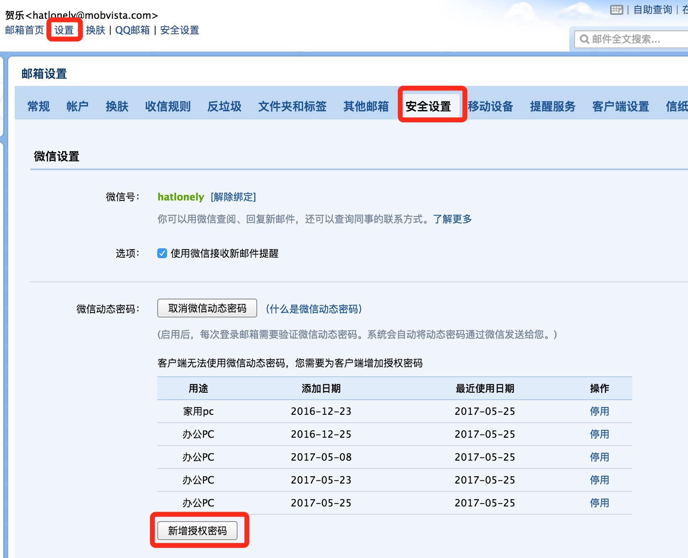
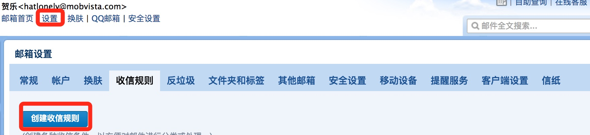
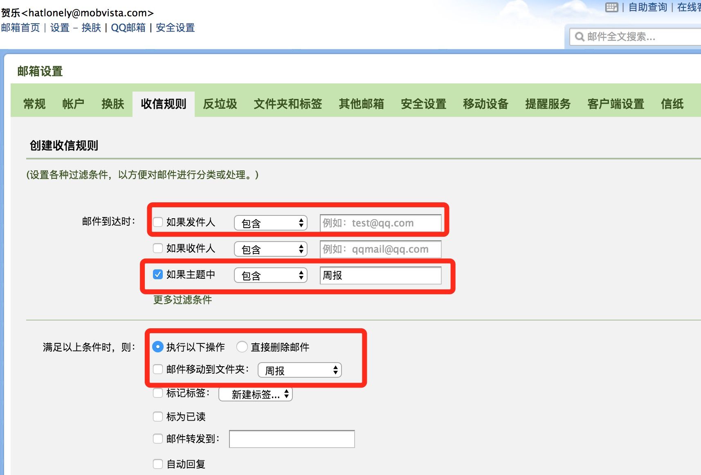
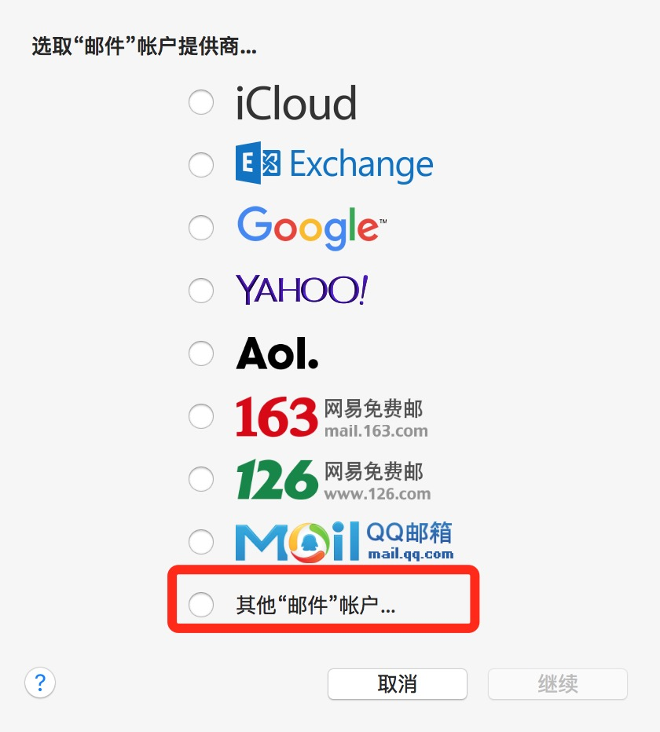
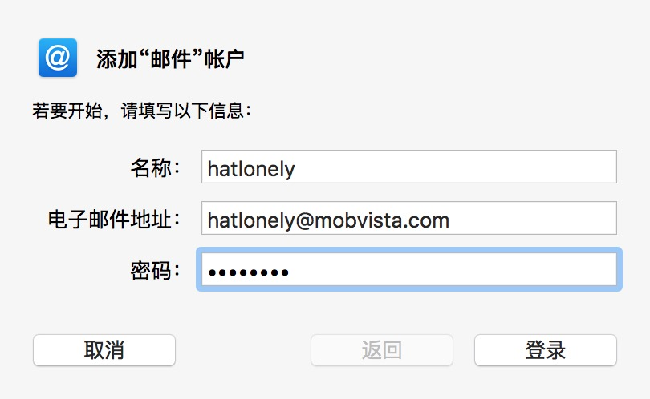
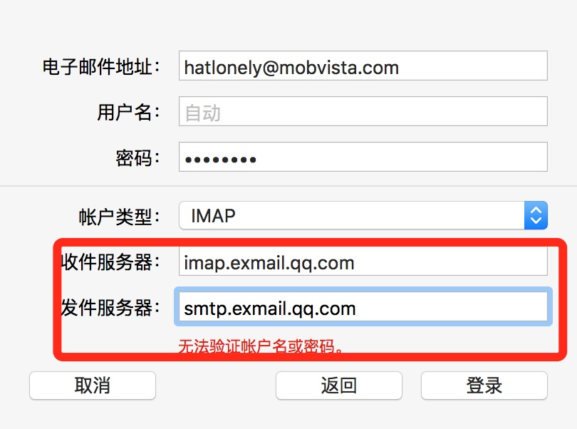
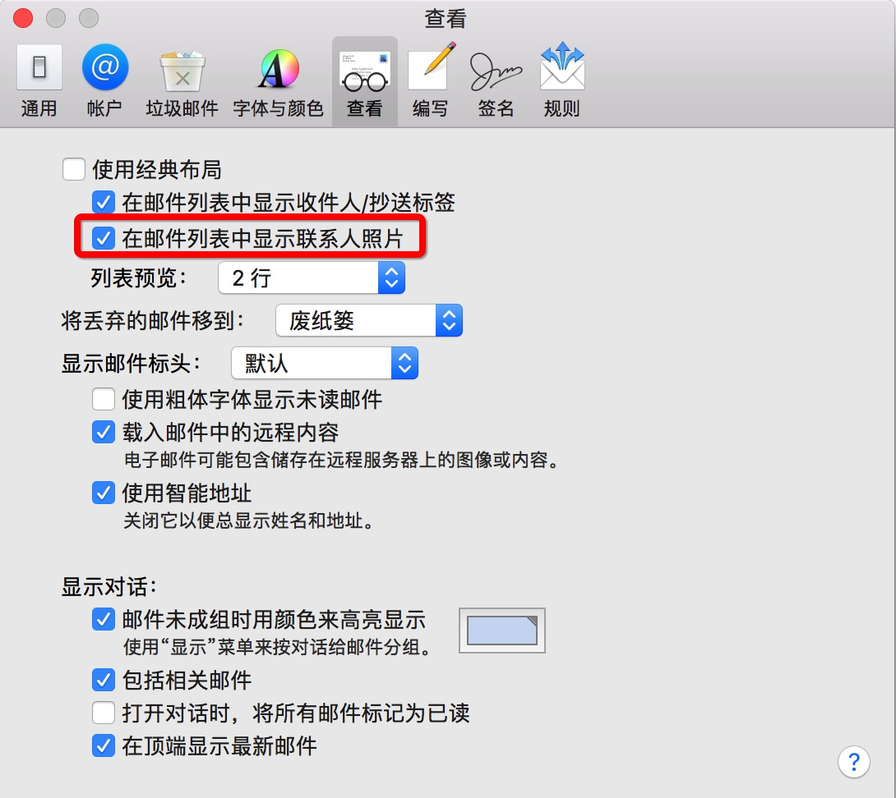
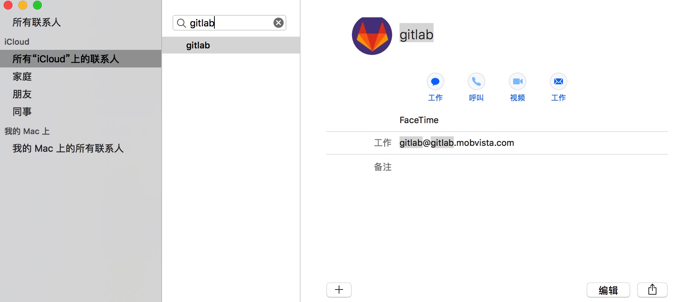
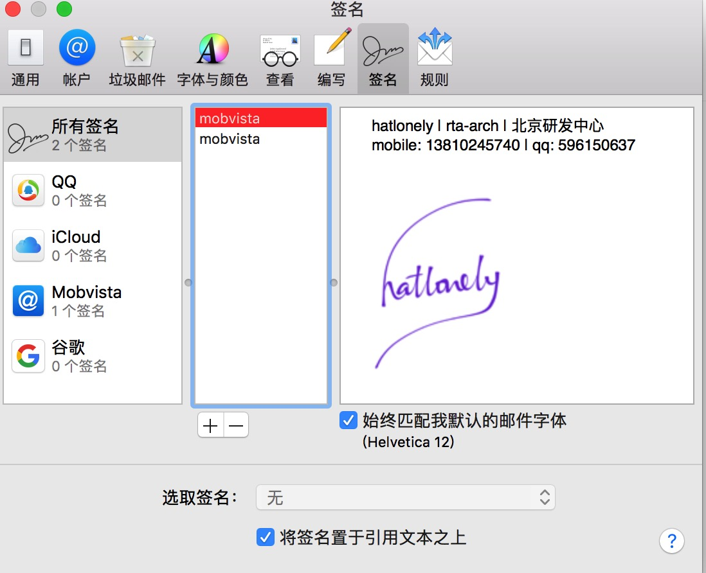

工具-邮件
=========

腾讯邮箱
--------

### 登陆设置

**POP3/SMTP协议**

接收邮件服务器：pop.exmail.qq.com ，使用SSL，端口号995  
发送邮件服务器：smtp.exmail.qq.com ，使用SSL，端口号465  
海外接收邮件服务器：hwpop.exmail.qq.com ，使用SSL，端口号995  
海外发送邮件服务器：hwsmtp.exmail.qq.com ，使用SSL，端口号465  

**IMAP协议**

接收邮件服务器：imap.exmail.qq.com  ，使用SSL，端口号993  
发送邮件服务器：smtp.exmail.qq.com ，使用SSL，端口号465  
海外接收邮件服务器：hwimap.exmail.qq.com ，使用SSL，端口号993  
海外发送邮件服务器：hwsmtp.exmail.qq.com ，使用SSL，端口号465  

### 授权密码

<https://exmail.qq.com/>

`设置` -> `安全设置` -> `新增授权密码`

### 收件规则

`设置` -> `收信规则` -> `创建收信规则` -> `如果收件人包含` -> `邮件移动到文件夹`

邮件客户端
----------

Mac自带的邮件客户端

### 邮箱设置

### 发件人头像

显示的头像是通讯录中的头像

`邮件` -> `偏好设置` -> `查看` -> `在邮件列表中显示联系人照片`

### 签名设置

`邮件` -> `偏好设置` -> `签名`

