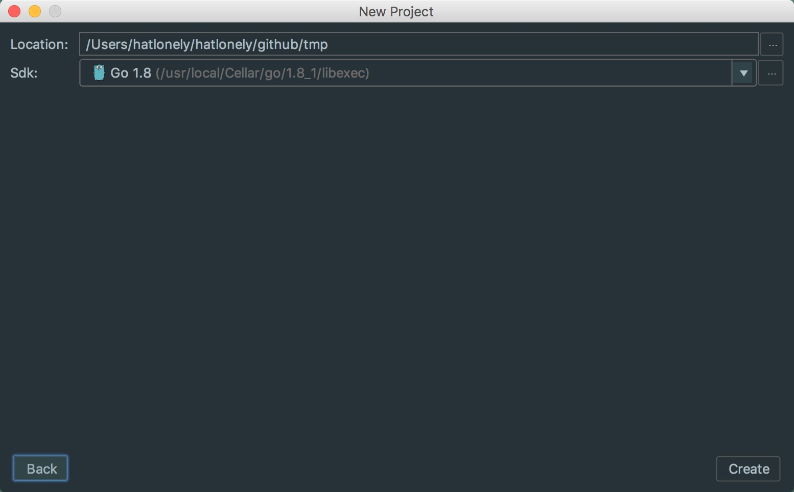
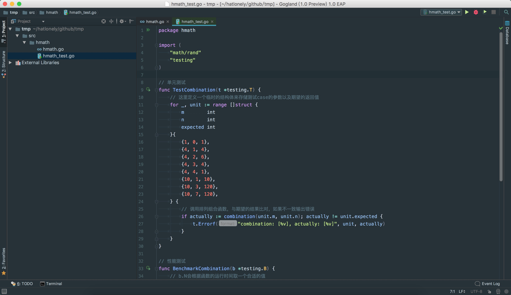
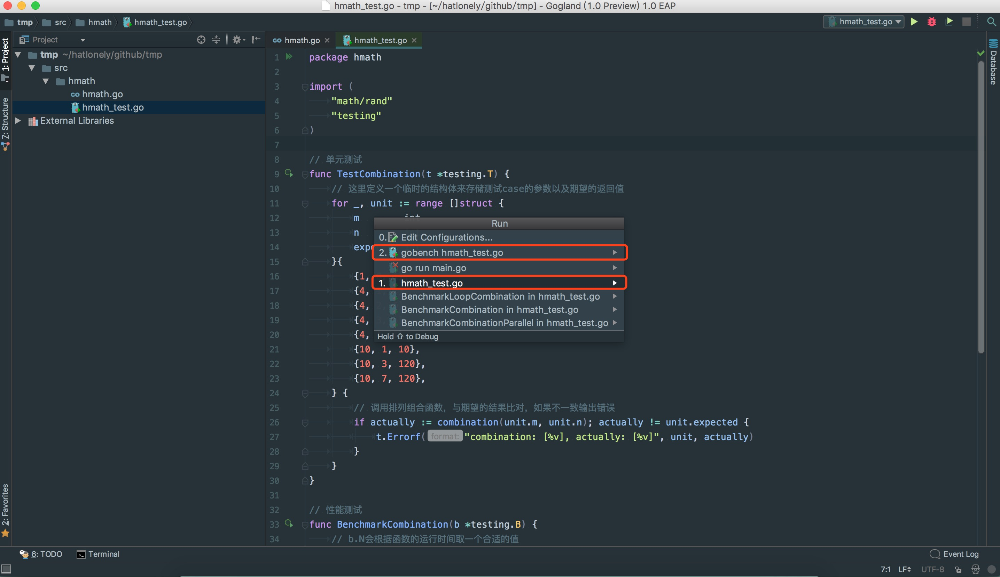
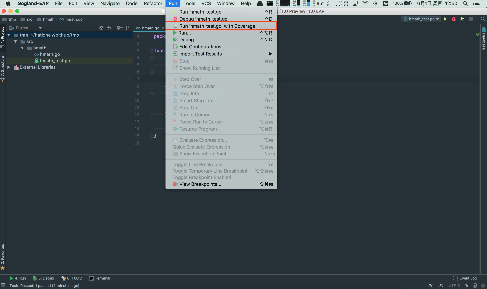
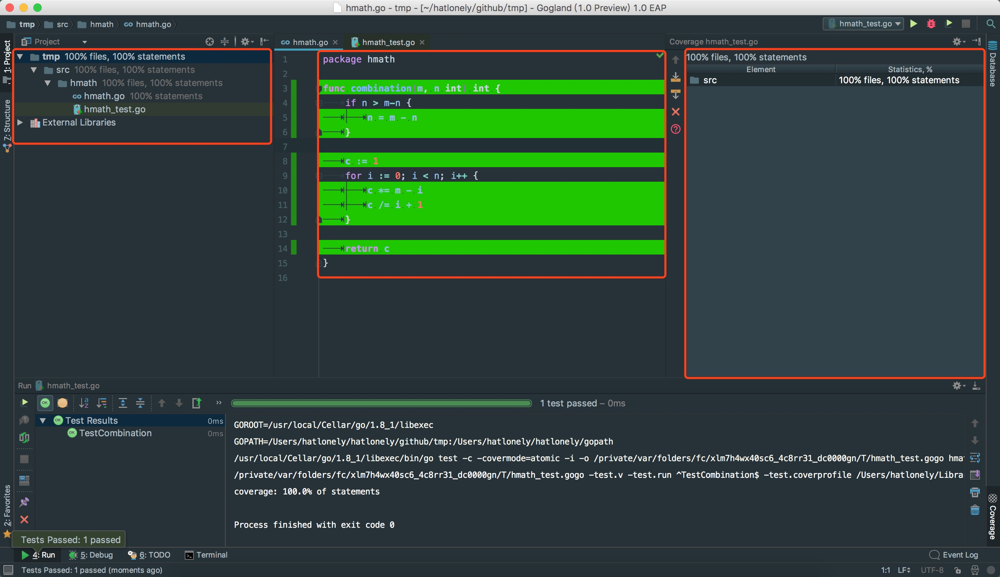

Go单元测试
==========

简介
----

单元测试是go语言级别提供的完整功能，测试代码以`*_test.go`命名，单元测试的case以`Test`开头，性能测试case以`Benchmark`开头，运行测试命令：`go test <test_file_list>`


例子
----

实现排列组合函数以及对应的单元测试和性能测试

### 创建工程目录结构

目录结构说明参见[规范-项目](规范-项目.md)

```
└── src
    └── hmath
        ├── hmath.go
        └── hmath_test.go
```

### 实现排列组合函数

``` go
// src/hmath/hmath.go

package hmath

func combination(m, n int) int {
    if n > m-n {
        n = m - n
    }

    c := 1
    for i := 0; i < n; i++ {
        c *= m - i
        c /= i + 1
    }

    return c
}
```

### 实现单元测试和性能测试

``` go
// src/hmath/hmath_test.go

package hmath

import (
    "math/rand"
    "testing"
)

// 单元测试
// 测试全局函数，以TestFunction命名
// 测试类成员函数，以TestClass_Function命名
func TestCombination(t *testing.T) {
    // 这里定义一个临时的结构体来存储测试case的参数以及期望的返回值
    for _, unit := range []struct {
        m        int
        n        int
        expected int
    }{
        {1, 0, 1},
        {4, 1, 4},
        {4, 2, 6},
        {4, 3, 4},
        {4, 4, 1},
        {10, 1, 10},
        {10, 3, 120},
        {10, 7, 120},
    } {
        // 调用排列组合函数，与期望的结果比对，如果不一致输出错误
        if actually := combination(unit.m, unit.n); actually != unit.expected {
            t.Errorf("combination: [%v], actually: [%v]", unit, actually)
        }
    }
}

// 性能测试
func BenchmarkCombination(b *testing.B) {
    // b.N会根据函数的运行时间取一个合适的值
    for i := 0; i < b.N; i++ {
        combination(i+1, rand.Intn(i+1))
    }
}

// 并发测试
func BenchmarkCombinationParallel(b *testing.B) {
    // 测试一个对象或者函数在多线程的场景下面是否安全
    b.RunParallel(func(pb *testing.PB) {
        for pb.Next() {
            m := rand.Intn(100) + 1
            n := rand.Intn(m)
            combination(m, n)
        }
    })
}

```

### 运行单元测试和性能测试

``` shell
export GOPATH=$(pwd)
go test src/hmath/*.go           # 单元测试
go test --cover src/hmath/*.go   # 单元测试覆盖率
go test -bench=. src/hmath/*.go  # 性能测试
```

上面命令的输出如下：
``` shell
hatlonely@localhost: ~/hatlonely/github/tmp $ go test src/hmath/hmath*.go
ok      command-line-arguments  0.005s
hatlonely@localhost: ~/hatlonely/github/tmp $ go test --cover src/hmath/hmath*.go
ok      command-line-arguments  0.005s  coverage: 100.0% of statements
hatlonely@localhost: ~/hatlonely/github/tmp $ go test -bench=. src/hmath/*.go
BenchmarkCombination-8                100000        217618 ns/op
BenchmarkCombinationParallel-8       3000000           401 ns/op
PASS
ok      command-line-arguments  23.599s
```

setup teardown
--------------

golang自带的这个测试框架里面没有直接的setup teardown的实现,可以通过下面方法实现全局的setup teardown,无法实现具体每个case之间的setup teardown

```
func TestMain(m *testing.M) {
	// setup code...
	os.Exit(m.Run())
	// teardown code...
}
```

Gogland
-------

### 导入工程

`create new project`



### 编码



### 运行单元测试

`Run` -> `Run`



### 运行测试覆盖

`Run` -> `Run 'hmath_test.go' with Coverage`



测试覆盖结果：




